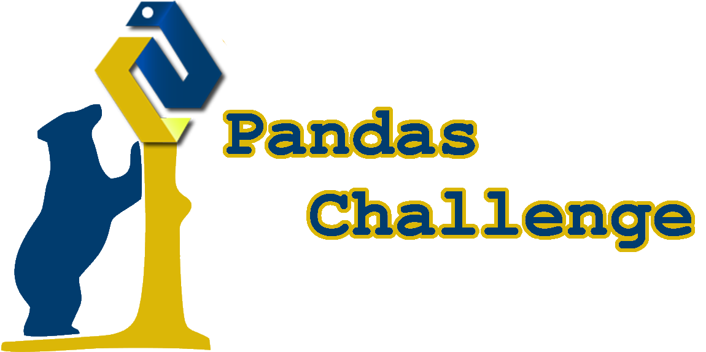

## This project consists of two daya analysis: the micro-transactions by players in an independent f2p videogame and some students metric for an education district

# ***Changelog:***

## **03/29/2021**
- Created/cloned the repository
- Created the file structure
- Added header for readme
- Created header, [readme](HeroesOfPymoli/readme.md) and [changelog](HeroesOfPymoli/changelog.md) for Heroes Of Pymoli

## **04/08/2021**
- Created header, [readme](PyCitySchools/readme.md) and [changelog](PyCitySchools/changelog.md) for School District project
